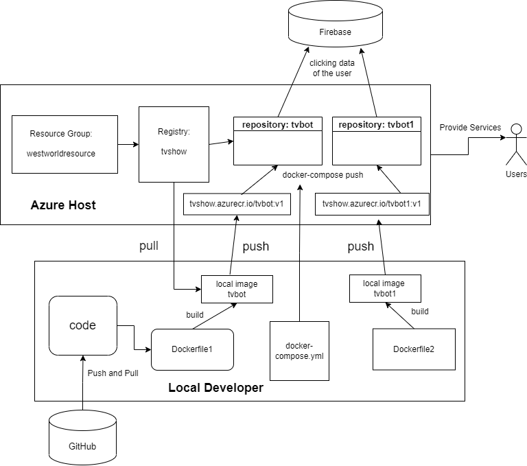

# Chatbot

## Member Info

Group ID: 32

Yuwei Tang   21442946 https://github.com/letokanoce

Weiming Mai  21422885 https://github.com/WaimenMak

Project Repository:  https://github.com/WaimenMak/Chatbot

Chat Bot ID: bot1: westworld;  bot2: hdjjdg_bot

### Function 

The bot would contain following command functions:

- /start: The bot will response with greeting and the user's last name. 
- /start : Displaying info of the initial instructions
- /help : Some detailed  instrctions
- /get_own_telegram_id : Get the telegram id of ourselvs.
- Sending@ : The prefix of the sharing command.

## Deployment Procedure

### Azure and Our Work flow

The app is hosted on Azure, we create two containers to run two independent chat-bots for two users. The overall diagram of our project system is shown as follow, it including the description of the database we use and github host:

## References

[Azure]: https://app.diagrams.net/?src=about

- Azure:  https://app.diagrams.net/?src=about
