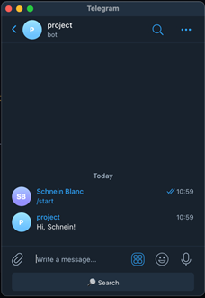
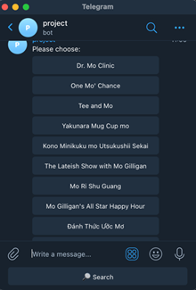
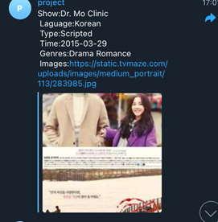
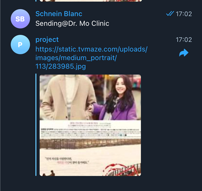
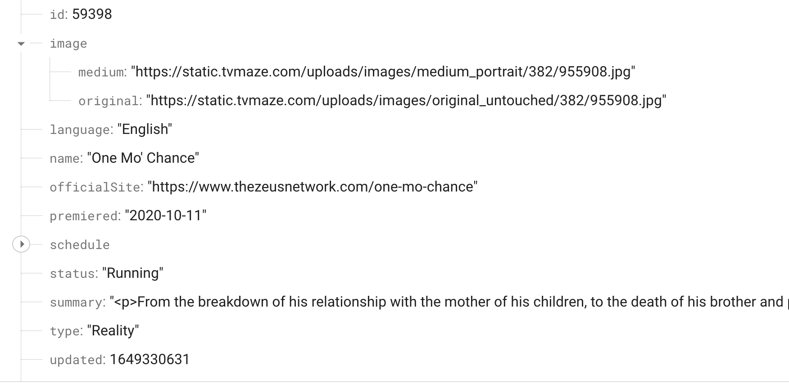
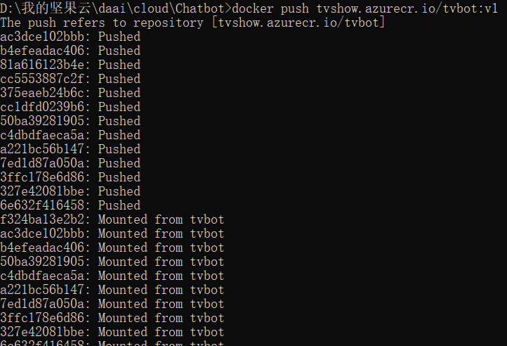
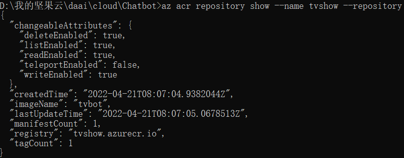
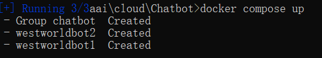
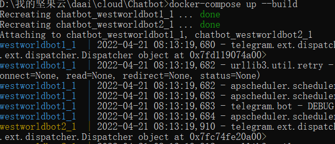
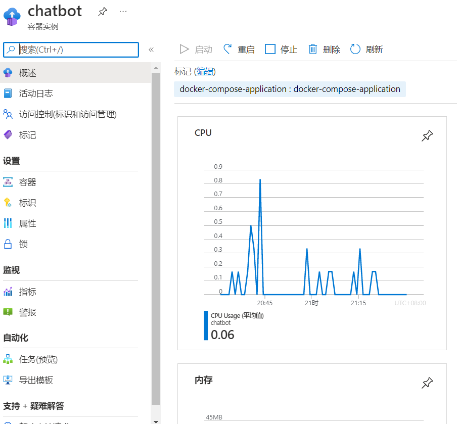

# COMP7940 Report

## Member Info

Goup ID: 32

Yuwei Tang    21442946

Weiming Mai  21422885

## Chatbot Feature Introduction

Traditional and regular social activities cannot be carried out routinely because to the covid 19 epidemic and the social locking down. As a result, people are attempting to socialize via internet platforms. To stay in touch with their pals, people employ a variety of cloud services.

This project creates and deploys a Telegram-based chatbot robot. People can use this robot to query a list of TV series they want to watch, get extensive information about TV shows, and exchange posters from their favorite shows. Use Firebase's cloud database to store the requested data, and the REST API supplied by tvmaze to perform snapshots and data exchanges. We deployed our program using Microsoft's Azure platform and containerized it using Docker.

 

|      |                                                              |      |                                                              |
| ---- | ------------------------------------------------------------ | ---- | ------------------------------------------------------------ |
|      |  |      |  |
|      |                                                              |      |                                                              |


A lot of the time, we don't know what a TV show is called. We usually just remember a few letters or a portion of a name. We can acquire a list of prospective TV shows by typing a few letters using tvmaze's api, which allows us to do fuzzy search for names. In the chatbot, we utilize the inlinebutton to display the list in the dialogue box as a list. At the same time, we save the data we find in our FIREBASE database to make future queries easier and the system run faster.


We'll select the key information we want to display as callback data and feed it to each button when we construct the list. When the button is pressed, we can use the callback data to track the relatively vast and complex information in the database, such as genre and posters. The exact information of the TV show we clicked in the dialog box is then displayed.



The database reduces the time it takes for our system to function, retrieves the information we need from a large online public database, and boosts the system's flexibility and scalability. It provides quick information support for our system, much like a dynamic cache. We can distribute larger messages, such as posters from TV shows we uncover, and send messages to bots, owing to database support.



The following figure shows the structure of the database:



### Function 

The bot would contain following command functions:

- /start: The bot will response with greeting and the user's last name. 
- /help : 
- /get_my_id:


## Deployment Procedure

The app is hosted on Azure, we create two containers to run two independent chat-bots for two users. The overall diagram of our project system is shown as follow, it including the description of the database we use and github host:


### Create Resource Group and Registry on Azure

To host a container on Azure, we first need to build a resource group and a regisitry:

```yaml
az group create --name westworldresource --location eastus
```

We named the resource group as `westworldresource`. After that create the registry base on:

```cmd
az acr create --resource-group westworldresource --name tvshow --sku Basic
```

### Build Images

Firstly build up the local image `tvbot` and `tvbot1` according to `Dockerfile`, the content of the file shown as follow:

```dockerfile
From tvbot
COPY main.py /
COPY search.py /
COPY secret_key.json /
COPY requirements.txt /
RUN pip install pip update
RUN pip install -r requirements.txt
ENV ACCESS_TOKEN  5160604243:AAE6Qs-_21_3325ONlKIpO-gybcsYQzaqlA
ENV DATABASE_URL  https://comp7940projectmt-default-rtdb.asia-southeast1.firebasedatabase.app/
ENV KEY_PATH  secret_key.json

CMD python main.py
```

After that we tag these tow images with the remote registry's name `tvshow.azurecr.io/tvbot:v1`

```dockerfile
docker tag tvbot tvshow.azurecr.io/tvbot:v1

docker tag tvbot1 tvshow.azurecr.io/tvbot1:v1
```

And then push them to azure registry

```cmd
docker push tvshow.azurecr.io/tvbot:v1

docker push tvshow.azurecr.io/tvbot1:v1
```

here's the pushing results.




The next screen shot shows the pushed image on the registry.



The next step we create a `docker-compose.yaml` file to provide two services `westworldbot1` and `westworldbot2`:

```yaml
version: '3'
services:
  westworldbot1:
    image: tvshow.azurecr.io/tvbot1:v1
    # build: .
    environment:
      - ACCESS_TOKEN=5398859275:AAH5X0dOUBOspdDvhcVUYoM93TRJu-e8m2g
      - KEY_PATH=secret_key.json
      - DATABASE_URL=https://comp7940projectmt-default-rtdb.asia-southeast1.firebasedatabase.app/
    command: python main.py

  westworldbot2:
    image: tvshow.azurecr.io/tvbot:v1
    # build: .
    environment:
      - ACCESS_TOKEN=5160604243:AAE6Qs-_21_3325ONlKIpO-gybcsYQzaqlA
      - KEY_PATH=secret_key.json
      - DATABASE_URL=https://comp7940projectmt-default-rtdb.asia-southeast1.firebasedatabase.app/
    command: python main.py

```

### Create Context and Deployment

To deploy the app, we need to create a new context for connection of docker and Azure subscription and container groups.

```dockerfile
docker context create aci westworldbot

docker context use westworldbot
```

We can use docker-compose to host two container simultaneously using the `docker-compose up`.



Some logs for creating two containers:



The  chatbot app is hosted on Azure.



## Job Division

In  this project, Yuwei Tang mainly focus on the app features design and database utilization. (Some commit log of Yuwei was missing). Weiming Mai mainly responsible for the app deployment. 

## References

[Azure]: https://app.diagrams.net/?src=about


